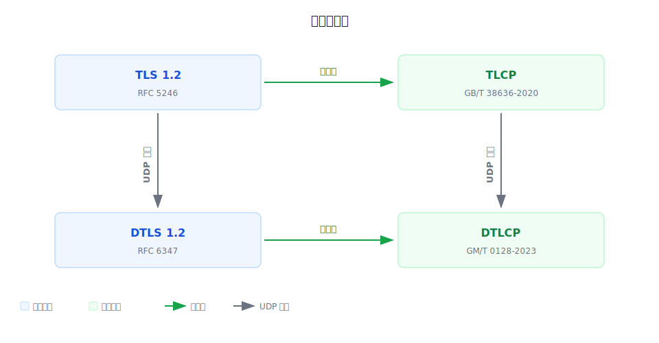

# Go TLCP

[](https://github.com/Trisia/gotlcp/actions/workflows/go.yml)
[](https://pkg.go.dev/gitee.com/Trisia/gotlcp)


> **在使用 GoTLCP 前，请务必悉知 [《Go TLCP 免责声明》](免责声明.md)！**

GoTLCP 采用 Go 语言实现的国密传输层密码协议套件，同时支持以下两个协议标准：

- **TLCP** — 遵循 GB/T 38636-2020《信息安全技术 传输层密码协议》，基于 TCP 传输的传输层密码协议（也称 GMSSL）
- **DTLCP** — 遵循 GM/T 0128-2023《数据报传输层密码协议》，基于 UDP 传输的数据报传输层密码协议



GoTLCP 实现了记录层协议、握手协议族以及密钥计算，支持完整握手、会话重用（TLCP）、传输保护、单向身份认证（认证服务端）和双向身份认证。

### TLCP

TLCP 遵循 GB/T 38636-2020，基于 TCP（`net.Conn`）提供可靠传输，适用于 Web 服务、API 网关等基于 TCP 的国密安全通信场景。

- **密码套件：** ECC_SM4_GCM_SM3、ECC_SM4_CBC_SM3、ECDHE_SM4_GCM_SM3、ECDHE_SM4_CBC_SM3

- **双证书：** 签名证书 + 加密证书，服务端必须同时提供
- **会话重用：** 通过 LRU 缓存和会话票据支持

### DTLCP

DTLCP 遵循 GM/T 0128-2023，基于 UDP（`net.PacketConn`）提供数据报传输层密码保护，适用于需要国密安全通信但无法依赖 TCP 可靠传输的场景。

- **密码套件：** ECC_SM4_GCM_SM3、ECC_SM4_CBC_SM3、ECDHE_SM4_GCM_SM3、ECDHE_SM4_CBC_SM3

- **双证书：** 签名证书 + 加密证书，服务端必须同时提供
- **会话重用：** 通过 LRU 缓存和会话票据支持
- **四态握手状态机：** Preparing → Sending → Waiting → Finished，适应 UDP 异步收发
- **指数退避重传：** 握手消息超时自动重传，退避策略保证收敛
- **无状态 Cookie 防 DoS：** 服务端通过 HelloVerifyRequest + HMAC-SM3 Cookie 验证客户端可达性
- **epoch + 序列号滑动窗口：** 防止重放攻击

> **密码套件优先级：** ECC_SM4_GCM_SM3 > ECC_SM4_CBC_SM3 > ECDHE_SM4_GCM_SM3 > ECDHE_SM4_CBC_SM3

*若 clone 和文档预览存在困难，请移步 [https://gitee.com/Trisia/gotlcp](https://gitee.com/Trisia/gotlcp)*

## 安装

为了安装使用 GoTLCP，您需要首先安装 [Go](https://go.dev/) 并且设置您的 Go 环境，GoTLCP 至少需要您的 Go 版本在 **1.25 及以上**。

通过下面命令就可以安装 GoTLCP：

```bash
go get -u gitee.com/Trisia/gotlcp
```

> GoTLCP 将持续保证 API 的向下兼容，您可以放心的升级 GoTLCP 库至最新版本。

## TLCP 快速开始

### 客户端

```go
package main

import (
	"fmt"
	"gitee.com/Trisia/gotlcp/tlcp"
)

func main() {
	conn, err := tlcp.Dial("tcp", "127.0.0.1:8443", &tlcp.Config{InsecureSkipVerify: true})
	if err != nil {
		panic(err)
	}
	defer conn.Close()

	buff := make([]byte, 516)
	n, err := conn.Read(buff)
	if err != nil {
		panic(err)
	}
	fmt.Printf(">> %s\n", buff[:n])
}
```

- 完整代码见 [example/quickstart/client/main.go](./example/quickstart/client/main.go)

### 服务端

```go
package main

import (
	"gitee.com/Trisia/gotlcp/tlcp"
	"net"
)

func main() {
	config := &tlcp.Config{
		Certificates: []tlcp.Certificate{sigCert, encCert},
	}
	listen, err := tlcp.Listen("tcp", ":8443", config)
	if err != nil {
		panic(err)
	}
	var conn net.Conn
	for {
		conn, err = listen.Accept()
		if err != nil {
			panic(err)
		}
		_, _ = conn.Write([]byte("Hello Go TLCP!"))
		_ = conn.Close()
	}
}
```

- 完整代码见 [example/quickstart/server/main.go](./example/quickstart/server/main.go)

> 若您需要同时支持 TLCP/TLS 协议，请参考 [GoTLCP 协议适配器](./pa/README.md) 相关内容。

## DTLCP 快速开始

### 客户端

```go
package main

import (
	"fmt"
	"gitee.com/Trisia/gotlcp/dtlcp"
)

func main() {
	conn, err := dtlcp.Dial("udp", "127.0.0.1:8443", &dtlcp.Config{InsecureSkipVerify: true})
	if err != nil {
		panic(err)
	}
	defer conn.Close()

	_, err = conn.Write([]byte("Hello DTLCP Server!"))
	if err != nil {
		panic(err)
	}
	buff := make([]byte, 516)
	n, err := conn.Read(buff)
	if err != nil {
		panic(err)
	}
	fmt.Printf(">> %s\n", buff[:n])
}
```

- 完整代码见 [example/dtlcp/quickstart/client/main.go](./example/dtlcp/quickstart/client/main.go)

### 服务端

```go
package main

import (
	"gitee.com/Trisia/gotlcp/dtlcp"
)

func main() {
	config := &dtlcp.Config{
		Certificates: []dtlcp.Certificate{sigCert, encCert},
	}
	ln, err := dtlcp.Listen("udp", ":8443", config)
	if err != nil {
		panic(err)
	}
	defer ln.Close()

	for {
		conn, err := ln.Accept()
		if err != nil {
			panic(err)
		}
		go func() {
			defer conn.Close()
			buf := make([]byte, 1024)
			n, _ := conn.Read(buf)
			conn.Write([]byte("Hello DTLCP Client!"))
			_ = buf[:n]
		}()
	}
}
```

- 完整代码见 [example/dtlcp/quickstart/server/main.go](./example/dtlcp/quickstart/server/main.go)

## 文档

### TLCP

- **[关于 TLCP 协议](./doc/AboutTLCP.md)** — TLCP 协议介绍、握手流程、密码套件说明，适合了解 TLCP 协议原理
- **[数字证书及密钥](./doc/CertAndKey.md)** — 签名证书与加密证书的解析和构造方法，用于准备 TLCP/DTLCP 双证书配置
- **[客户端配置](./doc/ClientConfig.md)** — TLCP 客户端 Config 字段详解，用于开发 TLCP 客户端应用
- **[服务端配置](./doc/ServerConfig.md)** — TLCP 服务端 Config 字段详解，用于开发 TLCP 服务端应用
- **[HTTPS 配置](./doc/HTTPsConfig.md)** — TLCP HTTPS 客户端和 Gin/Fiber 服务端配置，用于搭建国密 HTTPS 服务
- **[协议适配器](./pa/README.md)** — TLCP/TLS 自适应监听器，用于同时提供 TLCP 和 TLS 服务

### DTLCP

- **[DTLCP 快速入门](./doc/DTLCP-QuickStart.md)** — DTLCP 协议概述、服务端/客户端快速启动，适合快速上手 DTLCP
- **[DTLCP 配置与使用指南](./doc/DTLCP-Config.md)** — DTLCP Config 字段详解、安全配置建议，用于开发 DTLCP 应用
- **[DTLCP 设计文档](./doc/DTLCP-Design.md)** — 协议栈架构、记录层、握手协议、Flight 机制、重传状态机、Cookie 防 DoS 等原理说明

### 其他

- **[免责声明](免责声明.md)** — 使用 GoTLCP 的法律声明与保证条款
- **[GoTLCP 示例](https://gitee.com/Trisia/gotlcp/tree/main/example)** — 全部示例代码入口

## 致谢

- 项目中的 SM 系列算法由 [emmansun/gmsm](https://github.com/emmansun/gmsm) 项目实现，其项目中通过 CPU 指令集优化了算法效率。
- 项目 TLCP 协议代码裁剪自 go 1.19 版本 [golang/src/crypto/tls](https://github.com/golang/go/tree/go1.19/src/crypto/tls) 模块。
