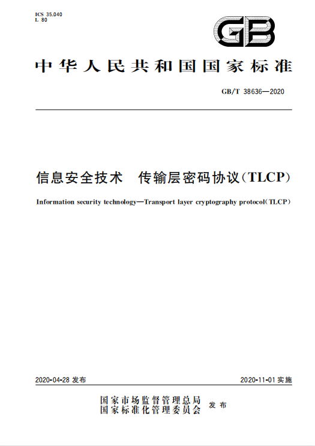
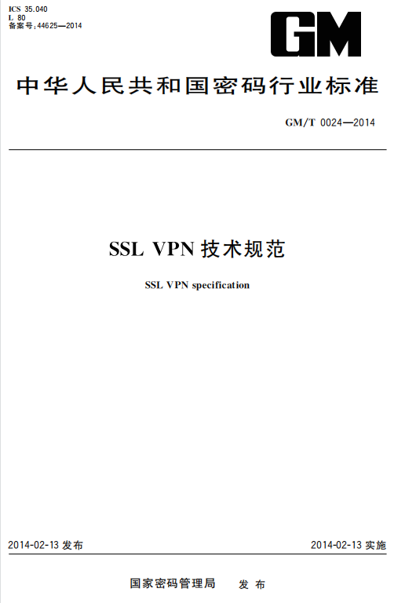

# 关于 TLCP

传输层密码协议 **T**ransport **L**ayer **C**ryptography **P**rotocol (TLCP) 

TLCP协议采用国产系列密码算法和数字证书等密码技术保障传输层的机密性、完整性、身份认证和抗攻击。

TLCP协议被定义于《GB/T 38636-2020 信息安全技术 传输层密码协议》，由国家市场监督管理局与国家标准化管理委员会于
2020年4月发布，在2020年11月实施。

在此之前TLCP的前身 SSL VPN（国密）早已经在密码行业使用多年，这里就需要提及《GM/T 0024-2014 SSL VPN技术规范》，也就是
也就是俗称的GMSSL（国产密码算法的SSL），以下简称 **GMSSL**。

《GM/T 0024-2014》 的协议内容参照传输层安全协议(RFC4346 TLS1.1)，按照我国相关密码政策和法规，结合
我国实际应用需求及产品生产厂商的实践经验，在TLS1.1的握手协议中增加了ECC、IBC的认证模式
和密钥交换模式，取消了DH密钥交换方式，修改了密码套件的定义。另外,在本标准中还增加了网关-网关协议。 ——《GM/T 0024-2014》 引言

| 对比项 | GM/T 0024-2014（GMSSL） | GB/T 38636-2020（TLCP）|
| :-- | :-- | :-- |
| 区别 | 密码行业标准 | 国家标准 |
| 用途 | 主要用于SSL VPN产品的研制，也可以指导SSL VPN产品的监测、管理和使用。 | 适用于传输层密码协议相关产品（如SSL VPN网关、浏览器等）的研制，也可以用于指导传输层密码协议相关产品的监测、管理和使用。 |
| 算法 | 支持国密SM1、SM2、SM3、SM4、SM9，对称加密加密模式仅支持CBC模式 | 支持国密SM1、SM2、SM3、SM4、SM9，对称加密加密模式仅支持GCM、CBC模式 |
| 协议 | 记录层协议、握手协议族、密钥计算、网关-网关协议 | 记录层协议、握手协议族、密钥计算 |
