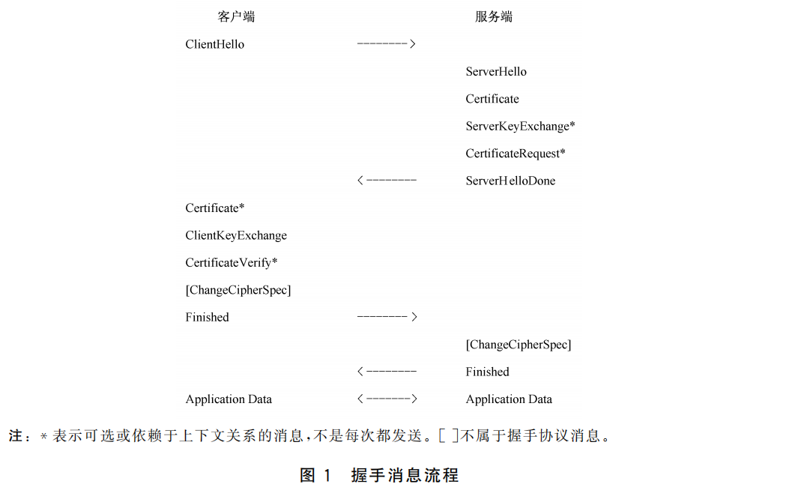

# GoTLCP 数字证书及密钥

注：TLCP协议中，基于 ECC/ECDHE 密钥交换的密码套件要求数字证书格式为 X.509 格式，数字证书格式参见 《GMT 0015-2012 基于SM2密码算法的数字证书格式》，其中服务端证书为“服务器证书”；基于 SM9 标识密码的 IBC/IBSDH 套件**不使用数字证书**，改用 KGC 公共参数与标识密钥，详见第 3 节《SM9 标识密码（IBC）的密钥与参数》。

## 1. TLCP协议的证书和密钥

TLCP协议以CS（Client and Server）的架构实现通信：

- 连接的发起方称为**客户端**（client）
- 接受连接的一方称为**服务端**（server）



### 1.1 服务端密钥 及 客户端根证书

区别于TLS协议，TLCP协议要求服务端需要使用2对非对称密钥对以及2张证书，它们分别是：

- 签名密钥对、签名证书，用于身份认证。
- 加密密钥对、加密证书，用于密钥交换，特别的加密密钥对应由外部密钥管理机构（KMC）产生并由外部认证机构签发加密证书。（见 GM/T
  0024 7.3.1.1.1）

我们将签名密钥对与加密密钥对统称为 **服务端密钥** 。

数字证书要求：

- 签名证书要求密钥用法具有 **数字签名（Digital Signature）、防抵赖（Non-Repudiation）**，扩展密钥用法要求具有 *
  *服务器身份验证(`1.3.6.1.5.5.7.3.1`)**
- 加密证书要求密钥用法具有 **数据加密（Data Encipherment）**

**若服务端开启了对客户端的身份认证**，那么此时客户端将会传输它的认证证书以及认证密钥的签名值供服务端验证（详见 GB/T 38636
6.4.4 握手协议总览），为了有效验证客户端证书的有效性，**服务端需要预先导入客户端的根证书列表**，否则无法验证客户端证书有效导致握手终止。

### 1.2 客户端密钥 及 服务端根证书

根据服务端对客户端认证要求的不同，客户端在握手流程具有不同表现，目前服务端对客户端认证方式支持：

- **不需要认证**，服务端不需要认证客户端身份**不需要客户端密钥**。
- **要求客户端身份认证**，该方式下需要客户端必须**拥有客户端密钥**。

若服务端开启了握手**要求客户端身份认证**，那么客户端必须具有客户端密钥，并且在握手过程中将会发送**客户端证书消息（Client
Certificate）**、**客户端证书验证消息（Certificate Verify）**

为了与服务端的签名证书与签名密钥对区别，通常使用客户端**认证密钥对、认证证书** 来称呼客户端签名密钥对及证书。

按照握手协议在服务端发送了服务端的证书列表（两张证书，签名证书、加密证书），那么客户端应验证分别两张证书的有效性，因此*
*客户端需要预先导入服务端根证书列表**，否则无法验证服务端证书有效导致握手终止。

数字证书要求：

- 认证证书要求密钥用法具有 **数字签名（Digital Signature）、防抵赖（Non-Repudiation）**，扩展密钥用法要求具有 *
  *客户端身份验证(`1.3.6.1.5.5.7.3.2`)**

> 注：TLCP协议区别TLS协议，TLCP协议的服务端证书消息中为2张证书，按顺序分别为签名证书、加密证书。

## 2. Go TLCP证书及密钥

### 2.1 数字证书解析

目前Go TLCP通过`emmansun/gmsm`的`smx.509`模块，目前数字证书解析支持数字证书的PEM格式，您可以通过下面这个方式解析证书：

````go
cert, err := smx509.ParseCertificatePEM([]byte(ROOT_PEM))
if err != nil {
panic(err)
}
````

- ROOT_PEM：x.509 ASN1.1 DER编码的PEM格式字符串。

示例见 [cert_parse/main.go](../example/certkey/cert_parse/main.go)

### 2.2 GoTLCP 证书密钥对

GoTLCP修改自golang `1.19`的`crypto/tls`，采用了`tlcp.Certificate`的对象作为证书和密钥证书密钥对，`tlcp.Certificate`结构下：

```go
package tlcp

// Certificate 数字证书及密钥对
type Certificate struct {
	Certificate [][]byte          // 数字证书DER二进制编码数组
	PrivateKey  crypto.PrivateKey // 密钥对接口
}
```

您需要提供以下参数构造该对象：

- **Certificate**：数字证书DER二进制编码数组，TLCP只要求提供1张与该密钥有关的数字证书，不需要而外提供证书链。
- **PrivateKey**：密钥对，实现了`crypto.PrivateKey`接口的都可以作为密钥对。

#### 2.2.1 数字证书

关于 `Certificate [][]byte ` 您可以通过，`smx509.Certificate`对象的`Raw`字段获取数字证书的DER编码，如下：

```go
cert, _ := smx509.ParseCertificatePEM(CERT_PEM_CODE)
var certKey = tlcp.Certificate{}
certKey.Certificate = [][]byte{cert.Raw}
```

#### 2.2.2 密钥对

<b style="color:red">警告：请在确保密钥符合国家密码管理要求前提下，管理使用非对称密钥对。</b>

GoTLCP根据密钥的用途，要求密钥的实现相应的Go标准接口：

- 数字签名，实现`crypto.Signer`
- 数据解密，实现`crypto.Decrypter`

相关接口定义如下：

```go
package crypto

type Signer interface {
	// Public 公钥
	Public() PublicKey
	// Sign 数字签名
	Sign(rand io.Reader, digest []byte, opts SignerOpts) (signature []byte, err error)
}

type Decrypter interface {
	// Public 公钥
	Public() PublicKey
	// Decrypt 私钥解密
	Decrypt(rand io.Reader, msg []byte, opts DecrypterOpts) (plaintext []byte, err error)
}
```

> 关于`crypto.Signer`、`crypto.Decrypter`
> 更多信息见 [src/crypto/crypto.go](https://github.com/golang/go/blob/master/src/crypto/crypto.go)

服务端密钥对：

- 签名密钥对需要实现`crypto.Signer`
- 加密密钥对需要实现`crypto.Decrypter`

客户端密钥对：

- 认证密钥对需要实现`crypto.Signer`

通过上述接口抽象与解耦，可以实现与SDF、SKF接口对接，通过密码硬件设备实现相应的密码功能。

示例见 [custom_key_cert/main.go](../example/certkey/custom_key_cert/main.go)

#### 2.2.3 测试密钥对构造

若您正处于测试与调试阶段，您可以实现目前GoTLCP提供的接口来实现证书、密钥的解析，构造`tlcp.Certificate`。

目前仅支持对 X509 DER PEM编码的证书证书 与 PKCS#8格式（未加密）PEM编码的SM2密钥解析，您可以按照下面方式解析密钥对及证书：

```go
keycert, err := tlcp.LoadX509KeyPair(certFile, keyFile)
if err != nil {
panic(err)
}
```

- certFile: X509 DER PEM编码的数字证书文件路径。
- keyFile: PKCS#8格式PEM编码证书文件路径。

或使用`tlcp.X509KeyPair`从PEM的字节码中解析。

示例见 [testuse_keypair/main.go](../example/certkey/testuse_keypair/main.go)

## 3. SM9 标识密码（IBC）的密钥与参数

本章仅在启用 **IBC/IBSDH 密码套件**时需要关注，相关配置见 [IBC 配置与使用指南](./IBC-Config.md)。使用 ECC/ECDHE 套件时请阅读第 1、2 章，本章可以跳过。

### 3.1 为什么 SM9 不使用数字证书

SM9 属于标识密码（Identity-Based Cryptography，IBC）：用户的公钥不再是一串随机数与身份的绑定，而是**直接由标识推导**得到：

```
用户公钥 = H1(标识 ‖ hid) · P
```

其中 `hid` 用于区分密钥用途（签名、密钥交换、加密），`P` 为 KGC 主公钥中的基点。因此 SM9 天然不需要数字证书来“证明公钥属于某个身份”，取而代之的是两样材料：

- **KGC 公共参数（`IBCSysParams`）**：包含签名主公钥、加密主公钥、KGC 域标识与有效期，是 SM9 的信任锚，作用相当于 X.509 体系中的根证书；
- **用户私钥**：由 KGC 使用主私钥按 `(标识, hid)` 派生，并通过带外渠道下发给用户。

| 维度 | ECC/ECDHE 套件（X.509） | IBC/IBSDH 套件（SM9） |
|------|------------------------|----------------------|
| 身份凭证 | 数字证书（签名证书 + 加密证书） | 标识（`Identity`）+ 公共参数（`IBCSysParams`） |
| 公钥来源 | 证书中的公钥 | 由标识与 `hid` 推导 |
| 私钥来源 | 本地生成或由 KMC 下发 | 由 KGC 按 `(标识, hid)` 派生 |
| 信任锚 | 根证书（`RootCAs` / `ClientCAs`） | KGC 公共参数信任池（`RootIBCSysParams` / `ClientIBCSysParams`） |
| 有效期载体 | 证书的 `notBefore` / `notAfter` | `IBCSysParams.Validity` 与 `issuerID` |
| 协议报文 | Certificate 携带 X.509 证书 | Certificate（IBC 变体）携带 `ibc_id` 与 `ibc_parameter` |

> 依据 GM/T 0024-2023《SSL VPN 技术规范》，IBC/IBSDH 套件不使用 X.509 证书；在 IBC 套件下，`tlcp.Config.Certificates`、`RootCAs`、`ClientCAs` 等字段不参与握手。

### 3.2 密钥体系：KGC 主密钥与用户私钥

SM9 的密钥体系分为两层。

#### 3.2.1 第一层：KGC 主密钥对

由 KGC 离线生成并保管，**主私钥绝不下发**，仅主公钥随公共参数公开：

| 主密钥 | 类型 | 公开部分 | 用途 |
|--------|------|---------|------|
| 签名主密钥对 | `sm9.SignMasterPrivateKey` / `sm9.SignMasterPublicKey` | 签名主公钥 | 派生签名私钥；校验 `signed_params`、`CertificateVerify` 的签名 |
| 加密主密钥对 | `sm9.EncryptMasterPrivateKey` / `sm9.EncryptMasterPublicKey` | 加密主公钥 | 派生加密私钥与密钥交换私钥；加密预主密钥、IBSDH 密钥交换 |

两个主公钥会被写入 `IBCSysParams` 并随报文下发给对端。

#### 3.2.2 第二层：用户私钥

由 KGC 按 `(标识, hid)` 派生后下发给用户，一套标识对应三把用途不同的私钥：

| 用户私钥 | `hid` | 由哪个主私钥派生 | 用途 | 服务端 | 客户端 |
|---------|-------|----------------|------|--------|--------|
| `SignPrivateKey` | `0x01` | 签名主私钥 | 签名 `signed_params` / `CertificateVerify` | IBC、IBSDH 均必需 | 双向认证时必需 |
| `KeyExchangePrivateKey` | `0x02` | 加密主私钥 | IBSDH 的 SM9 密钥交换 | IBSDH 必需 | IBSDH 必需 |
| `EncryptPrivateKey` | `0x03` | 加密主私钥 | IBC 套件解密预主密钥 | IBC 必需 | 不需要 |

<b style="color:red">警告：三把用户私钥均由 `(标识, hid)` 唯一确定，用途不可互换。</b>尤其是 `KeyExchangePrivateKey`（`hid=0x02`）与 `EncryptPrivateKey`（`hid=0x03`）虽然同以加密主私钥为根，但 `hid` 不同即得到不同的密钥对；用加密私钥参与密钥交换不会立即报错，而是推迟到 `Finished` 阶段才以 `bad record MAC` 失败。**本库不校验 `KeyExchangePrivateKey` 的派生 `hid`**，KGC 派发与本地装载环节需自行核对（详见 [IBC 配置与使用指南](./IBC-Config.md) §4.3）。

### 3.3 KGC 公共参数与信任池

`tlcp.IBCSysParams` 对应 GM/T 0081-2020《SM9 密码算法加密签名消息语法规范》附录 A.2 定义的 `IBCSysParams`，是 IBC 报文中 `ibc_parameter` 字段的载荷。关键字段如下：

| 字段 | 说明 |
|------|------|
| `DistrictName` / `DistrictSerial` | KGC 域名称与域序列号，共同唯一标识一个 KGC |
| `Validity` | 参数有效期（`ValidityPeriod`） |
| `IBCPublicParameters` | 多算法式列表，SM9 项内含 `SM9PublicParameterData` |
| `IssuerID` | 公共参数颁发者标识（`*Identifier`） |
| `SignMasterPublicKey` | 从 SM9 项解析出的签名主公钥 |
| `EncryptMasterPublicKey` | 从 SM9 项解析出的加密主公钥 |

与根证书类似，公共参数**必须通过带外渠道预先建立信任**。对端在报文中下发的 `ibc_parameter` 只作参考，最终用于验签与加密的始终是**本地信任池中命中的那一份**：

```go
// 客户端信任服务端所属 KGC 的公共参数
config.RootIBCSysParams = serverPool
// 服务端信任客户端所属 KGC 的公共参数
config.ClientIBCSysParams = clientPool
```

- 公共参数来源：KGC 直接下发 DER，用 `tlcp.ParseIBCSysParams` 解析；或由主密钥对通过 `tlcp.NewIBCSysParamsFromMaster` 生成；
- 存入信任池：`tlcp.NewIBCPool()` 创建池后调用 `AddParams` / `AddParamsDER`；
- 未配置信任池时，默认以本端 `IBCIdentity.Parameters` 作为信任池：对端参数必须与本端属于同一 KGC（`districtName` / `districtSerial` 与主公钥一致）；
- 信任池、`Config.VerifyIBCSysParams` 回调与本端公共参数都不可用时，IBC 握手直接失败；
- 完整握手会校验 `Validity` 与 `issuerID` 的有效期，过期参数不可用于加密操作。

### 3.4 GoTLCP 的 SM9 凭据：`tlcp.IBCIdentity`

与 `tlcp.Certificate` 对应，GoTLCP 用 `tlcp.IBCIdentity` 承载一套 SM9 身份凭据：本端标识 + 本端公共参数 + 由 KGC 下发的用户私钥。

```go
package tlcp

// IBCIdentity 一套 SM9 标识密码（IBC）身份凭据。
type IBCIdentity struct {
	Identity              []byte                 // 本端标识：裸字节串，或 GM/T 0090 Identifier 的 DER
	Parameters            *IBCSysParams          // 本端公共参数
	SignPrivateKey        *sm9.SignPrivateKey    // hid=0x01，签名私钥
	EncryptPrivateKey     *sm9.EncryptPrivateKey // hid=0x03，加密私钥
	KeyExchangePrivateKey *sm9.EncryptPrivateKey // hid=0x02，密钥交换私钥
}
```

- **`Identity`**：推荐直接使用裸字节串（如 `[]byte("server@kgc.example")`），可避免填写 `Identifier` 的必填有效期字段；
- **`Parameters`**：服务端以及双向认证的客户端必需，其余场景可为空；
- **私钥字段**：任一字段为空表示本端不具备该用途的能力。`KeyExchangePrivateKey` 为空即表示本端**不具备 IBSDH 能力**，IBSDH 套件不参与协商。

#### 3.4.1 装载密钥与参数

生产环境中，用户私钥通常由 KGC 以 **PKCS#8 DER** 形式下发（PEM 解码后），使用 `tlcp.LoadIBCIdentity` 装载：

```go
ident, err := tlcp.LoadIBCIdentity(
	identity,          // 标识，裸字节串或 Identifier DER
	paramsDER,         // IBCSysParams 的 DER，可为空
	signKeyDER,        // PKCS#8 DER，hid=0x01，可为空
	encKeyDER,         // PKCS#8 DER，hid=0x03，可为空
	keyExchangeKeyDER, // PKCS#8 DER，hid=0x02，可为空
)
if err != nil {
	panic(err)
}
config.IBCIdentity = ident
```

- 私钥由 `smx509.ParsePKCS8PrivateKey` 解析，支持 `*sm9.SignPrivateKey` / `*sm9.EncryptPrivateKey`；
- 装载只做结构解析：`keyExchangeKeyDER` **不会**校验派生 `hid`（应自行确保按 `hid=0x02` 派生），也不要求 `identity` 非空；手工构造 `IBCIdentity` 同样没有校验入口；
- `LoadIBCIdentity` 接收的是 **DER**；若手上是 PEM，先用 `encoding/pem` 的 `pem.Decode` 取出 `Block.Bytes` 再传入；
- 若 `KeyExchangePrivateKey` 用错用途（或两端 `hid` 不一致），握手会一直走到 `Finished` 才以 `bad record MAC` 失败——请在装载前核对 KGC 下发的私钥用途。

可运行示例（PEM 常量内嵌，解码为 DER 后装载并用于握手）：[服务端](../example/ibc/quickstart/server/main.go)、[客户端](../example/ibc/quickstart/client/main.go)

#### 3.4.2 测试密钥与参数构造

测试调试阶段可在进程内模拟 KGC，由主密钥对生成公共参数并派生用户私钥：

```go
// 1. KGC 生成两对主密钥
signMaster, _ := sm9.GenerateSignMasterKey(rand.Reader)   // 签名主密钥
encMaster, _ := sm9.GenerateEncryptMasterKey(rand.Reader) // 加密主密钥

// 2. 生成公共参数（IBCSysParams）
params, _ := tlcp.NewIBCSysParamsFromMaster(
	"kgc.example", 1,
	tlcp.ValidityPeriod{NotBefore: time.Now(), NotAfter: time.Now().AddDate(1, 0, 0)},
	signMaster, encMaster,
)

// 3. 为标识派生三把用户私钥
identity := []byte("server@kgc.example")
signPriv, _ := signMaster.GenerateUserKey(identity, 0x01) // 签名私钥
encPriv, _ := encMaster.GenerateUserKey(identity, 0x03)   // 加密私钥
kePriv, _ := encMaster.GenerateUserKey(identity, 0x02)    // 密钥交换私钥
```

<b style="color:red">警告：以上主密钥生成与用户私钥派生仅供测试与调试；生产环境的标识密钥必须由国家密码管理机构认可的 KGC 产生与管理。</b>

上例只为说明密钥来源；可运行示例把服务端与客户端两个**标识**、三把用户私钥与公共参数一并生成，并逐项编码为 **PEM 字符串**输出，可直接粘贴为通信示例中的内嵌常量（如需落盘，把 `fmt.Printf` 换成 `os.WriteFile` 即可）：

- 生成测试密钥与标识（输出 PEM）：[example/ibc/genkey/main.go](../example/ibc/genkey/main.go)
- 内嵌 PEM 并完成握手：[服务端](../example/ibc/quickstart/server/main.go)、[客户端](../example/ibc/quickstart/client/main.go)
- 运行方式见 [IBC 快速入门](./IBC-QuickStart.md)。

### 3.5 与 X.509 配置字段的关系

| 字段 | IBC/IBSDH 套件下的行为 |
|------|----------------------|
| `CipherSuites` | 必须显式包含 IBC/IBSDH 套件，否则永不协商 |
| `Certificates` / `GetCertificate` | 不使用；即使没有任何 X.509 证书，只要 IBC 配置齐备仍可完成握手 |
| `RootCAs` / `ClientCAs` / `VerifyPeerCertificate` | 不生效，由 `RootIBCSysParams` / `ClientIBCSysParams` / `VerifyIBCSysParams` 承担 |
| `ClientAuth` | 仍控制是否请求客户端认证（IBSDH 下自动强制要求，除非显式设为 `RequestClientCert`） |
| `InsecureSkipVerify` | 置 `true` 时**同时跳过** X.509 验证与 IBC 公共参数校验 |
| `IBCIdentity` / `GetIBCIdentity` / `GetClientIBCIdentity` | IBC 凭据入口，详见 [IBC 配置与使用指南](./IBC-Config.md) |

### 3.6 握手结果中的对端信息

握手完成后，对端的 SM9 信息通过 `ConnectionState` 暴露，可替代 X.509 场景下从 `PeerCertificates` 获取身份的方式：

```go
state := conn.ConnectionState()
state.PeerIBCIdentity  // []byte         对端 IBC 标识（标识内容，非封装字节）
state.PeerIBCSysParams // *IBCSysParams  对端提供、且已命中本地信任池的公共参数
```

两者仅在 IBC/IBSDH 套件下非空，会话重用后仍能正确填充。

## 4. 关键密钥置零

GoTLCP在工作过程中需要管理使用以下密钥：

- 预主密钥（pre_master_secret）
- 主密钥(master_secret)
- 工作密钥(work_secrets)

| 密钥名称                    | 置零时机     | 说明                                                  |
|:------------------------|:---------|:----------------------------------------------------|
| 预主密钥(pre_master_secret) | 主密钥生成后置零 | 双方协商生成的密钥素材，用于生成主密钥                                 |
| 主密钥(master_secret)      | 握手成功后    | 由预主密钥、客户端随机数、服务端随机数、产量字符串，经计算的密钥素材，用于生成工作密钥         |
| 工作密钥(work_secrets)      | 连接断开     | 包括数据加密密钥和校验密钥。其中数据加密密钥用于数据的加密和解密，校验密钥用于数据的完整性计算和校验。 |

由于Go语言的垃圾回收机制，依靠Go语言本身无法实现对内存的置零操作，因此GoTLCP设计了用于实现的内存置零的 setZero 方法：

1. 每次将内存块全部置0xFF，设置内存屏障防止编译器优化。
2. 再将内存块全部置0x00，设置内存屏障防止编译器优化。
3. 重复上述1、2步骤3次。

该方法可以有效防止编译器优化掉内存置零操作，确保密钥数据从内存中清除。

> **SM9/IBC 套件下的密钥生命周期**：IBC/IBSDH 套件协商出的预主密钥同样纳入上述置零流程；但 `IBCIdentity` 中的三把**用户私钥**（`hid=0x01/0x02/0x03`）属于长期密钥，由 KGC 下发并由使用者负责保存与销毁，GoTLCP 不对其做置零处理，请按国家密码管理要求管理。SM9 密钥交换过程中的临时中间状态（`keyExchange`）由 `gmsm` 的 `Destroy()` 在协商结束后释放。

