# DTLCP 数据报传输层密码协议 — 设计文档

## 1. 概述

### 1.1 协议定位

DTLCP（Datagram Transport Layer Cryptography Protocol，数据报传输层密码协议）是 GB/T 38636-2020 TLCP（传输层密码协议）在 UDP 传输层上的适配版本，定义于 GM/T 0128-2023。

**协议关系链：**


DTLCP 相对于 DTLS 1.2 的核心变化是：用国密算法（SM2/SM3/SM4）替换国际算法，保留 DTLS 的 UDP 适配机制（显式序列号、分片重组、无状态 Cookie、超时重传）。

### 1.2 设计目标

- 为基于 UDP 的两个应用程序之间提供**保密性**和**数据完整性**
- 应对 UDP 数据报的**丢包、乱序、重复**问题
- 防御基于 UDP 的 **DoS 放大攻击**
- 保持与 TLCP 在密码算法层面的完全兼容

### 1.3 协议版本

| 协议 | 版本号 | 说明 |
|------|--------|------|
| TLCP | `{0x01, 0x01}` | GB/T 38636-2020 |
| DTLCP | `{0x01, 0x01}` | GM/T 0128-2023，与 TLCP 相同 |
| DTLS 1.2 | `{254, 253}` | RFC 6347，采用 1's complement 编码 |

> **设计决策**：DTLCP 使用与 TLCP 相同的版本号 `{0x01, 0x01}` 而非 DTLS 的版本号方案。DTLCP 的协议区分不依赖版本号，而是通过记录层版本号 + 传输层特征（TCP/UDP）共同判断。

---

## 2. 协议栈架构

### 2.1 分层结构

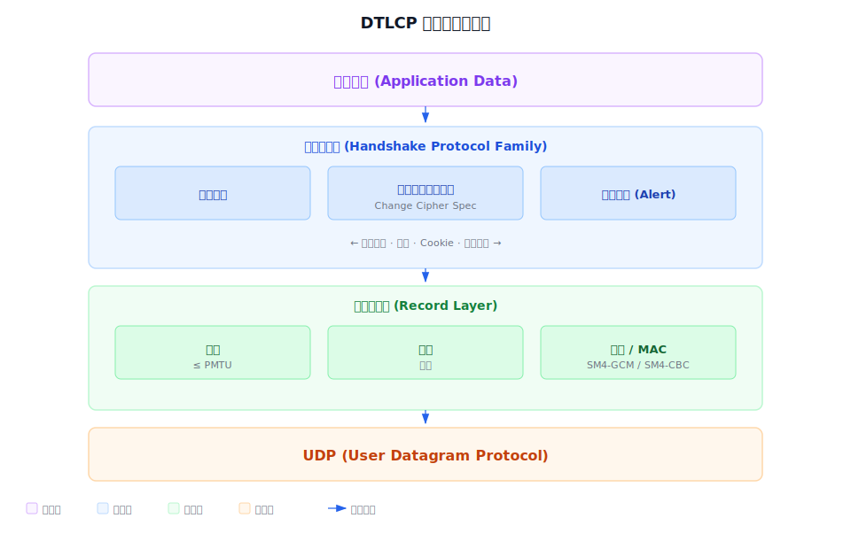

处理流程：

- **发送方向**：数据 → 分片 → 压缩（可选）→ 计算 MAC → 加密 → 传输
- **接收方向**：接收 → 解密 → 验证 MAC → 解压缩（可选）→ 重组 → 递交给上层

---

## 3. DTLCP 与 TLCP 的核心差异

### 3.1 差异总览

| 维度 | TLCP | DTLCP |
|------|------|-------|
| **传输层** | TCP（可靠、有序） | UDP（不可靠、无序） |
| **序列号** | 隐式（64位计数器，不传输） | 显式（epoch + sequence_number 字段） |
| **分片** | TCP 自动处理 | 握手消息手动分片（fragment_offset/length） |
| **重传** | TCP 保证 | 自实现状态机（PREPARING/SENDING/WAITING/FINISHED） |
| **DoS 防护** | 无 | 无状态 Cookie（HelloVerifyRequest） |
| **重放防护** | TCP 序列号天然防护 | 滑动窗口（默认64，最小32） |
| **消息边界** | 流式，可跨 TCP 段 | 单条记录必须在单个 UDP 报文内 |
| **多记录** | 连续流 | 同一 UDP 报文可含多个记录，连续放置 |

### 3.2 握手协议新增字段

| 新增 | 说明 |
|------|------|
| `message_seq`（uint16） | 握手消息序号，区分重传与重排序 |
| `fragment_offset`（uint24） | 分片偏移量，支持大消息分片 |
| `fragment_length`（uint24） | 当前分片长度 |
| `HelloVerifyRequest` 消息 | 无状态 Cookie 交换，防 DoS |
| `cookie` 字段（ClientHello） | 客户端携带服务端返回的 Cookie |

---

## 4. 密码算法与密钥体系

### 4.1 密码算法

#### 4.1.1 非对称密码算法

- **算法**：SM2（椭圆曲线公钥密码算法）
- **用途**：身份鉴别、数字签名、密钥交换
- **密钥交换模式**：
  - **ECC**：非前向安全，使用加密证书公钥直接加密预主密钥
  - **ECDHE**：前向安全，使用临时 ECC 密钥对协商预主密钥

#### 4.1.2 分组密码算法

- **算法**：SM4
- **工作模式**：GCM（Galois 计数器模式）或 CBC（密文分组链接模式）
- **用途**：密钥交换数据加密保护、报文数据加密保护

#### 4.1.3 密码杂凑算法

- **算法**：SM3
- **用途**：对称密钥生成、完整性校验（HMAC）

#### 4.1.4 数据扩展函数 P_hash

```
P_hash(secret, seed) = HMAC(secret, A(1) + seed) +
                        HMAC(secret, A(2) + seed) +
                        HMAC(secret, A(3) + seed) + ...
其中：
  A(0) = seed
  A(i) = HMAC(secret, A(i-1))
```

P_hash 可无限扩展输出，直到产生所需长度的密钥素材。

#### 4.1.5 伪随机函数 PRF

```
PRF(secret, label, seed) = P_hash(secret, label + seed)
```

使用 SM3 作为底层 HMAC 杂凑算法。

### 4.2 密码套件

| 优先级 | 密码套件 | 密钥交换 | 加密 | 校验 | 编码值 |
|--------|----------|----------|------|------|--------|
| 1 | ECC_SM4_GCM_SM3 | ECC | SM4-GCM | SM3 | `{0xe0, 0x13}` |
| 2 | ECC_SM4_CBC_SM3 | ECC | SM4-CBC | SM3 | `{0xe0, 0x11}` |
| 3 | ECDHE_SM4_GCM_SM3 | ECDHE | SM4-GCM | SM3 | `{0xe0, 0x53}` |
| 4 | ECDHE_SM4_CBC_SM3 | ECDHE | SM4-CBC | SM3 | `{0xe0, 0x51}` |

> **设计决策**：ECC 模式优先于 ECDHE 模式。ECC 模式下服务端加密证书公钥固定，客户端直接使用公钥加密预主密钥，无需额外握手交互。ECDHE 模式提供前向安全性但需要双方交换临时公钥。

### 4.3 密钥层次结构

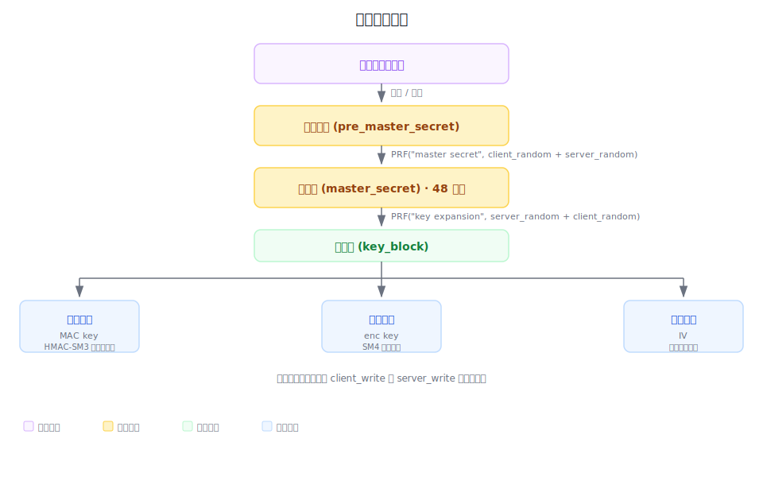

### 4.4 密钥种类

| 密钥类型 | 说明 |
|----------|------|
| **服务端密钥** | 签名密钥对（身份鉴别）+ 加密密钥对（密钥协商） |
| **客户端密钥** | 签名密钥对（身份鉴别）+ 加密密钥对（密钥协商） |
| **预主密钥** | 双方协商生成的密钥素材，用于生成主密钥 |
| **主密钥** | 48字节，由预主密钥 + 客户端随机数 + 服务端随机数计算 |
| **写密钥** | 发送方使用的工作密钥（加密 + 校验），分 client_write 和 server_write |
| **读密钥** | 接收方使用的工作密钥（解密 + 校验），分 client_write 和 server_write |

---

## 5. 记录层协议

### 5.1 记录层报文结构

DTLCP 记录层报文在 TLCP 记录头基础上新增两个字段（Epoch + SequenceNumber，共 8 字节），记录头总计 13 字节：

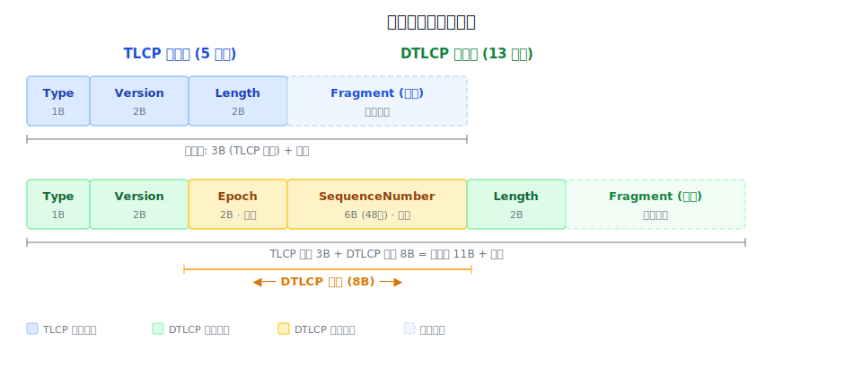

| 字段 | 大小 | 说明 |
|------|------|------|
| Type | 1 字节 | 记录类型：握手(22)、密码规格变更(20)、告警(21)、应用数据(23) |
| Version | 2 字节 | 协议版本 `{0x01, 0x01}` |
| Epoch | 2 字节 | 密码规格变更计数器，区分密钥阶段 |
| SequenceNumber | 6 字节（48位） | 显式序列号，同 epoch 内单调递增 |
| Length | 2 字节 | Fragment 长度 |
| Fragment | 变长 | 载荷数据

### 5.2 epoch 与 sequence_number

- 每个 epoch 开始时 sequence_number 初始化为 0
- 每次发送一个 DTLSPlaintext 记录时 sequence_number 单调递增
- 每次发送 ChangeCipherSpec 时 epoch 单调递增
- **epoch/sequence_number 对必须唯一**：在 2 倍 MSL 时间内 epoch 值不能重用
- 旧 epoch 的记录在收到新 epoch 数据后应丢弃
- epoch 或 sequence_number 回绕前必须终止连接，重新握手

epoch 状态转换：

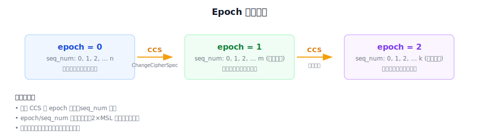

实现上将 epoch(2B) 与 seq_num(6B) 拼接为 8 字节参与 MAC 和 AEAD 的 AAD 计算，确保每条记录的序列号在网络层面唯一可验证。

### 5.3 MAC 计算

#### CBC 模式

```
MAC = HMAC_hash(
    write_MAC_secret,
    epoch + sequence_number + type + version + length + fragment
)
```

> **与 TLCP 关键差异**：TLCP 使用隐式的 64 位 `seq_num`（不传输），DTLCP 使用显式的 `epoch + sequence_number` 拼接为 64 位值参与 MAC 计算。

#### AEAD 模式（GCM）

附加鉴别数据（AAD）：

```
additional_data = epoch + sequence_number + type + version + length
```

> **与 TLCP 关键差异**：TLCP 的 AAD 使用隐式 64 位 seq_num，DTLCP 使用显式的 `epoch + sequence_number`。

### 5.4 分片规则

- 记录层将数据分成不超过 PMTU 的消息记录
- 每个 DTLCP 消息记录在单个 UDP 报文内
- **多个 DTLCP 记录可放在同一个 UDP 报文中**，连续放置
- UDP 报文载荷的第一个字节必须是 DTLCP 记录的开始
- 记录**不能跨 UDP 报文传输**

| 结构 | 最大 fragment 长度 | 说明 |
|------|---------------------|------|
| DTLSPlaintext | 2^14 (16384) | 与 TLCP 相同，不含头部 |
| DTLSCompressed | 2^14 + 1024 | 压缩后最多膨胀 1024 字节 |
| DTLSCiphertext | 2^14 + 2048 | 加密后最多膨胀 2048 字节 |

> **PMTU 感知**：发送方应尝试将记录大小控制在 PMTU 范围内，避免 IP 分片。详见 [§5.6 PMTU 与路径最大传输单元](#56-pmtu-与路径最大传输单元)。

### 5.5 重放保护

采用滑动窗口机制：

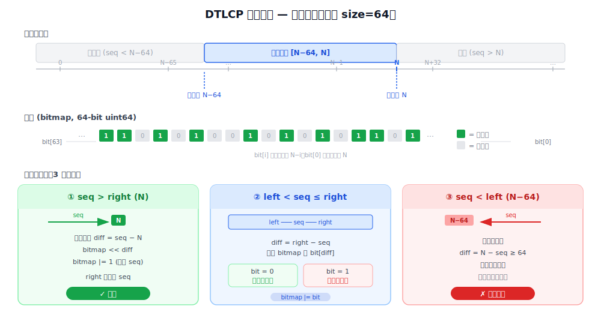

| 参数 | 说明 |
|------|------|
| 最小窗口大小 | 32 |
| 默认窗口大小 | 64 |
| 窗口右边缘 | 当前会话接收到的最高有效序列号 |
| 窗口左边缘 | 右边缘 - 窗口大小 |

处理流程：

1. 接收记录，检查序列号
2. 序列号 < 窗口左边缘 → 判定为重放，丢弃
3. 序列号在窗口内且已记录 → 判定为重复，丢弃
4. 序列号在窗口内且为新 → 进行 MAC 验证
5. MAC 验证成功 → 更新窗口
6. MAC 验证失败 → 丢弃记录（不更新窗口）

窗口大小由 `Config.ReplayWindow` 控制，高丢包、高乱序网络可适当增大（如 128）。

### 5.6 PMTU 与路径最大传输单元

#### 5.6.1 PMTU 概念

PMTU（Path Maximum Transmission Unit，路径最大传输单元）是指从发送方到接收方之间所有链路中 MTU 的最小值。对于基于 UDP 的 DTLCP 协议，PMTU 直接影响记录层分片策略——UDP 不提供 TCP 的分段重传机制，每个 DTLCP 记录必须完整地放入单个 UDP 报文，而 UDP 报文不能跨越 IP 分片边界。

RFC 6347 §4.1.1 明确规定：

> DTLS 记录层协议要求记录不得跨越多个底层数据报（即 UDP 报文）。因此 DTLS 实现必须确保记录大小不超过 PMTU，避免 IP 层分片。

PMTU 对 DTLCP 的影响体现在三个层面：

| 层面 | 影响 | 应对 |
|------|------|------|
| **记录层** | 应用数据记录必须 ≤ PMTU | `maxPayloadSizeForWrite()` 依据 PMTU 限制单次写入载荷 |
| **握手消息** | 握手消息可能远超 PMTU（如证书链可达数 KB） | 自动分片：fragment_offset / fragment_length 字段支持重组 |
| **UDP 打包** | 同一 UDP 报文可含多条短记录 | 连续放置，总长度 ≤ PMTU |

#### 5.6.2 以太网/IP 报文封装层次

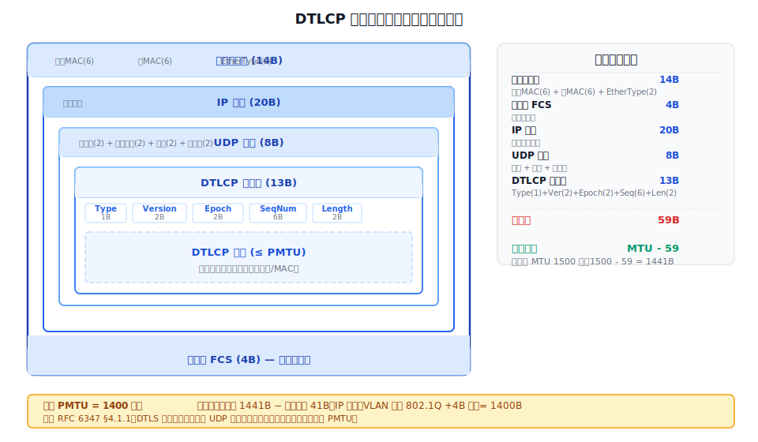

在典型以太网环境下，DTLCP 报文从内到外依次被 UDP、IP、以太网帧逐层封装：

| 层 | 头部大小 | 说明 |
|------|----------|------|
| 以太网帧头 | 14 B | 目标 MAC(6) + 源 MAC(6) + EtherType(2) |
| 以太网 FCS | 4 B | 帧校验序列（Frame Check Sequence） |
| IP 头部 | 20 B | 不含 IP 选项的标准 IPv4 头部 |
| UDP 头部 | 8 B | 源端口(2) + 目标端口(2) + 长度(2) + 校验和(2) |
| DTLCP 记录头 | 13 B | Type(1) + Version(2) + Epoch(2) + SeqNum(6) + Length(2) |
| **协议封装总开销** | **59 B** | 以太网头(18) + IP头(20) + UDP头(8) + DTLCP头(13) |

**默认 PMTU = 1400 的推导**：

```
理论最大 DTLCP 载荷 = 以太网 MTU 1500 - 协议开销 59B = 1441 B
预留余量   = 41 B  (IP 选项 + VLAN 标签 802.1Q +4B、PPPoE +8B、隧道封装等)
默认 PMTU  = 1441 - 41 = 1400 B  (保守值，适配绝大多数网络环境)
```

> 为什么预留 41 B？互联网环境中路径上可能存在 VLAN 标签（802.1Q 增加 4B）、IP 选项（最大 40B）、IPsec/隧道封装等附加头部。1400 B 是业界广泛采用的保守值，在保证通过率的同时尽量减少 IP 分片概率。

#### 5.6.3 DTLCP 实现中的 PMTU

**Config.PMTU 字段**（`common.go`）：

```go
type Config struct {
    // PMTU 是路径最大传输单元的估计值。超过此值的记录将被分片。
    // 默认值为 1400 字节。除非确切掌握网络 MTU，否则不应修改。
    PMTU int
}
```

**`maxPayloadSizeForWrite()` 实现**（`conn.go`）：

PMTU 作为单次写入的最大载荷限制，计算逻辑如下：

1. 取 `Config.PMTU`，若未设置则用默认值 1400
2. 扣除 DTLCP 记录头（13 B）和显式 nonce 长度
3. 扣除加密开销（AEAD overhead 或 CBC MAC 长度）
4. 结果与协议最大明文长度 `maxPlaintext`（2^14 = 16384）取较小值
5. 确保返回值 ≥ 1（极端 PMTU 配置下）

**握手消息分片**：当构造的握手消息超过 PMTU 时，`addHandshake()` 自动按 `fragment_offset` 递增拆分为多个 DTLCP 记录，每个分片的 `fragment_length` ≤ PMTU。

#### 5.6.4 PMTU 约束与记录打包

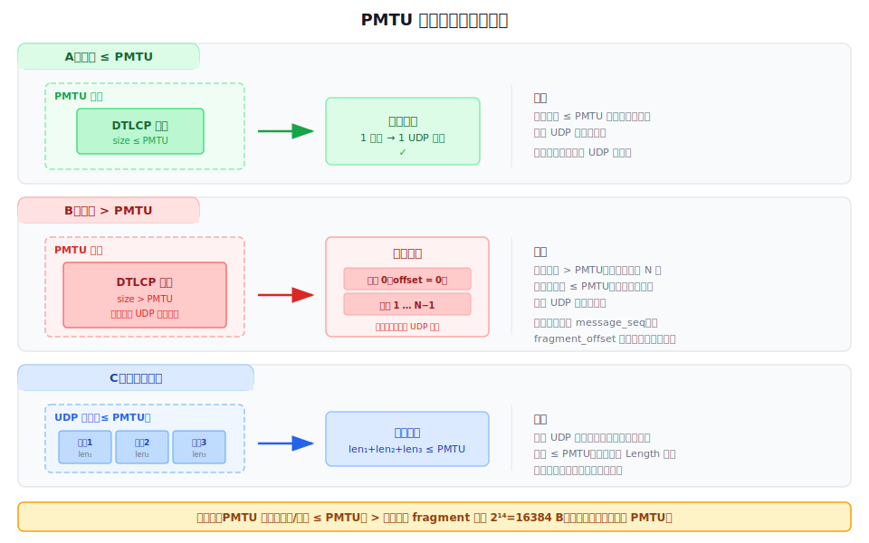

三种场景的规则：

**场景 A — 记录 ≤ PMTU**：记录直接封装为单个 UDP 报文发送，一记录一报文。这是最常见的情况。

**场景 B — 记录 > PMTU**：记录超出单个 UDP 报文容量，必须拆分为 N 个分片，每个分片 ≤ PMTU。接收方通过 `fragment_offset` + `fragment_length` 重组成完整消息。所有分片共享同一 `message_seq`。

**场景 C — 多记录打包**：同一 UDP 报文中可连续放置多条 DTLCP 记录，总长度 ≤ PMTU。UDP 载荷首字节必须是 DTLCP 记录头（Type 字段），接收方逐条解析记录头中的 Length 字段确定边界。记录之间无分隔符，也不得跨 UDP 报文。

**优先级关系**：

```
PMTU 约束（记录/打包 ≤ PMTU）> 协议最大 fragment 长度（2^14 = 16384 B）
```

即使协议允许最大 16384 B 的 plaintext，实际发送时仍受 PMTU 约束。当 PMTU < 16384 时以 PMTU 为准；当 PMTU > 16384 时以协议上限为准。在 DTLCP 中，16384 B 的协议上限远大于默认 PMTU 1400 B，因此 PMTU 是实际生效的限制。

### 5.7 PMTU 变化与动态适应

当前实现使用**静态 PMTU**（`Config.PMTU`），不支持 PMTU 动态发现（Path MTU Discovery，RFC 4821）。

**设计考虑**：

| 方案 | 优势 | 劣势 | 当前选择 |
|------|------|------|----------|
| 静态 PMTU（当前） | 实现简单，无额外网络开销 | 路径变化时可能 IP 分片或带宽浪费 | ✓ |
| ICMP PMTUD（RFC 1191） | 自动发现，准确 | ICMP 常被防火墙拦截；UDP 无连接，ICMP 不可靠 | ✗ |
| DPLPMTUD（RFC 8899） | 不依赖 ICMP，适合 UDP | 实现复杂，需探测算法 | ✗ |

**PMTU 变化时的处理**：

- 握手阶段：发现分片丢失率异常时，可降低 PMTU 重新分片发送（`fragmentBuffer` 支持重叠分片，PMTU 变小时的新分片能覆盖旧分片边界）
- 数据阶段：目前不支持动态调整，建议保守设置 PMTU（1400）适配大多数网络

> 参考 RFC 6347 §4.1.1.1：DTLS 实现可在握手阶段尝试 PMTU 发现，使用较小的记录探测路径，根据丢包情况调整。

---

## 6. 握手协议

### 6.1 握手消息头部

DTLCP 在 TLCP 握手消息头部基础上新增 3 个字段，支持 UDP 环境下的乱序到达和分片重组：

| 字段 | 大小 | 说明 |
|------|------|------|
| msg_type | 1 字节 | 消息类型（见下方类型列表） |
| length | 3 字节 | 原始消息总长度（重组后） |
| **message_seq** | 2 字节 | DTLCP 新增：消息序号，用于区分重传与重排序 |
| **fragment_offset** | 3 字节 | DTLCP 新增：当前分片在原始消息中的偏移量 |
| **fragment_length** | 3 字节 | DTLCP 新增：当前分片的数据长度 |

消息类型包括：HelloRequest(0)、ClientHello(1)、ServerHello(2)、**HelloVerifyRequest(3)**（DTLCP 新增）、Certificate(11)、ServerKeyExchange(12)、CertificateRequest(13)、ServerHelloDone(14)、CertificateVerify(15)、ClientKeyExchange(16)、Finished(20)。

HelloVerifyRequest 是 DTLCP 相对于 TLCP 唯一新增的消息类型，用于无状态 Cookie 交换。

### 6.2 message_seq 维护规则

- 每次握手的第一个消息 `message_seq = 0`
- 每产生一个新消息，`message_seq` 加 1
- **重传时使用相同的 message_seq**
- 接收方维护 `next_receive_seq` 计数器：
  - `message_seq == next_receive_seq` → 处理消息，计数器加 1
  - `message_seq < next_receive_seq` → 丢弃（重复消息）
  - `message_seq > next_receive_seq` → 排队缓存（乱序到达）

### 6.3 握手消息分片与重组

当握手消息超过 PMTU 时，发送方将消息分为 N 个连续分片：

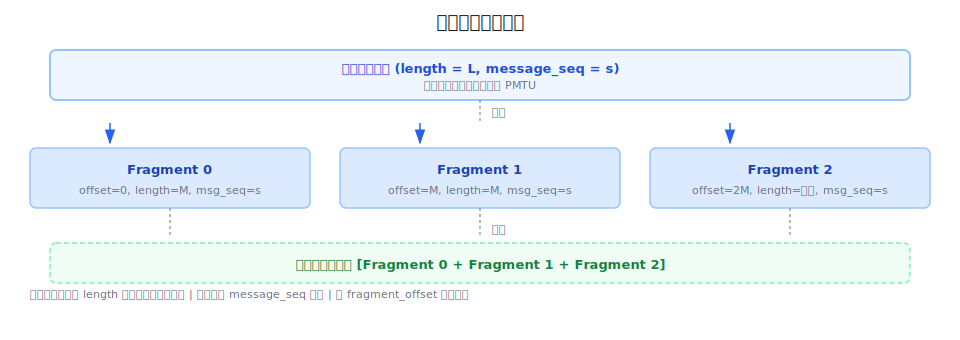

**关键规则**：
- 所有分片的 `length` 字段都等于原始消息总长度
- 所有分片的 `message_seq` 相同
- `fragment_offset` = 前面所有分片的累计字节数
- `fragment_length` = 当前分片的实际字节数
- 未分片消息：`fragment_offset = 0`，`fragment_length = length`
- **CertificateVerify 的哈希运算和 Finished 的校验数据计算中，必须先重组完整消息再参与运算**

实现上通过分片重组缓冲区完成：接收到分片后按 fragment_offset 缓存，直到所有分片收齐后拼接为完整消息；能处理重叠的分片序列（发送方可能在 PMTU 变化后使用更小的分片重传）。

### 6.4 完整握手流程

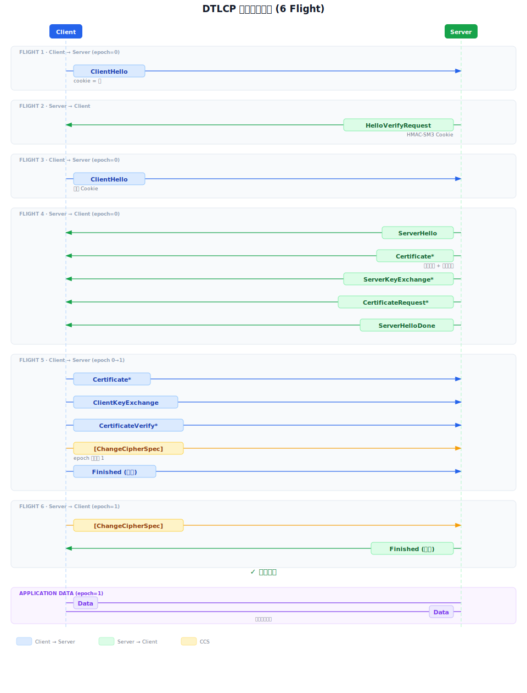

> `*` 表示可选消息，`[]` 表示不属于握手协议消息。

### 6.5 会话重用流程

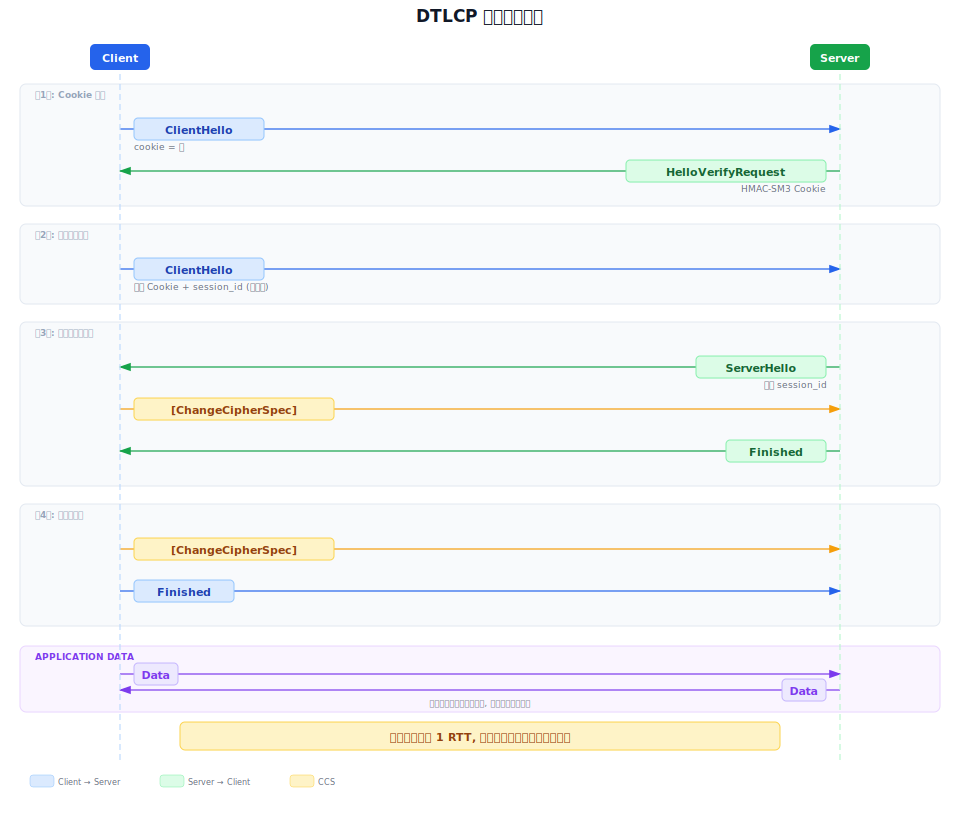

### 6.6 握手消息详解

#### ClientHello

- 首次发送时 cookie 为空（0 长度）
- 响应 HelloVerifyRequest 时，必须使用与原始 ClientHello 相同的参数
- 服务端用这些参数验证 cookie 合法性

#### HelloVerifyRequest

**Cookie 生成算法**：

```
Cookie = HMAC-SM3(Secret, Client-IP + Client-Parameters)
```

其中 `Client-Parameters` 包含 ClientHello 中的版本、随机数、会话ID、密码套件、压缩算法。

- 无状态：服务端不存储 Cookie，收到后重新计算验证
- 收到无效 Cookie → 当作无 Cookie 的新 ClientHello 处理

#### Server Certificate

- **必须包含双证书**：签名证书在前，加密证书在后
- 密钥交换算法与证书密钥类型对应：

| 密钥交换算法 | 证书密钥类型 |
|-------------|-------------|
| ECC | ECC 公钥，使用加密证书中的公钥 |
| ECDHE | ECC 公钥，签名证书用于签名临时公钥 |

#### ServerKeyExchange

当密钥交换算法需要额外参数时发送（ECDHE 需临时公钥，ECC 不需）。

#### Finished

校验数据生成：

```
verify_data = PRF(master_secret, finished_label,
                  SM3(handshake_messages))[0..11]
```

- `finished_label`：客户端用 `"client finished"`，服务端用 `"server finished"`
- `handshake_messages`：从 ClientHello 到本消息之前（不含本消息、CCS、HelloRequest）的所有握手消息
- **不包含**：初始 ClientHello（如被替换）和 HelloVerifyRequest

---

## 7. Flight 设计

### 7.1 协议规定的 6 个 Flight

DTLCP 握手协议将消息分组为 6 个独立 Flight（飞行），每个 Flight 是一组需连续发送的握手消息：

| Flight | 发送方 | 消息组成 | Epoch |
|--------|--------|----------|-------|
| Flight 1 | Client | ClientHello (cookie=空) | 0 |
| Flight 2 | Server | HelloVerifyRequest (含 Cookie) | 0 |
| Flight 3 | Client | ClientHello (带 Cookie) | 0 |
| Flight 4 | Server | ServerHello + Certificate + ServerKeyExchange\* + CertificateRequest\* + ServerHelloDone | 0 |
| Flight 5 | Client | Certificate\* + ClientKeyExchange + CertificateVerify\* + [ChangeCipherSpec] + Finished | 0→1 |
| Flight 6 | Server | [ChangeCipherSpec] + Finished | 1 |

> Flight 5 和 Flight 6 中各含一条 ChangeCipherSpec（不属于握手消息），标志着 epoch 从 0 翻转为 1。

### 7.2 实现机制

每个 Flight 通过 **buffering（缓冲）+ flush（刷新）** 机制实现，核心思路是"先累积，再一次性发送"：

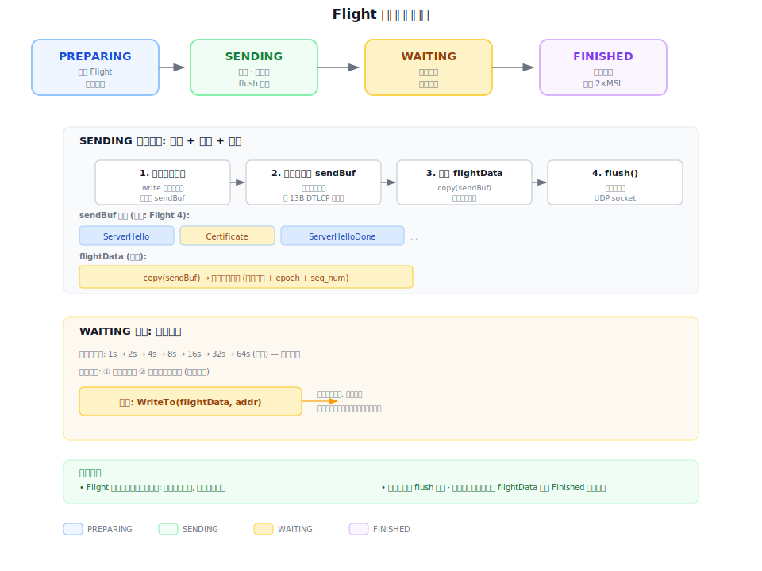

**设计意图**：Flight 的多条消息需作为一个原子单元处理——要么全部到达对端，要么全部重传。缓冲机制确保同一 Flight 的消息不会被其他数据插入打断，flush 确保底层 UDP 报文连续发出。

### 7.3 flightData 快照与重传

发送 Flight 后，将 `sendBuf` 的完整字节快照保存为 `flightData`。重传时直接原样写入 UDP socket，不重新序列化。

**为什么用快照而非重新序列化？**

1. 快照已包含 DTLCP 记录头（epoch + seq_num 已编码），与原始发送完全一致
2. 避免重复 marshaling 开销
3. 保证重传内容与首次发送逐字节相同——若重新序列化，随机数字段等可能变化，导致 Finished 校验值不一致

**实现要点**：快照保存时机必须在 `flush()` 之前，因为 flush 会清空 sendBuf。快照保存的是**完整 sendBuf**（含所有记录头和分片），重传时直接 `WriteTo(flightData, remoteAddr)`。

### 7.4 Flight 与分片的关系

一个 Flight 中的握手消息可能超過 PMTU，需分片传输：

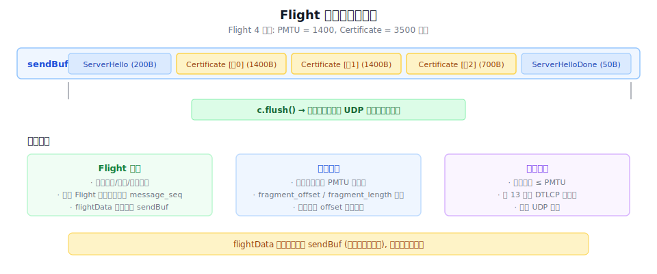

- 分片发生在**单个握手消息**级别：消息超过 PMTU 时，在握手消息头部填入 `fragment_offset` 和 `fragment_length` 字段，由发送方拆分为多个记录，接收方重组
- 同一个 Flight 的所有分片共享相同的 `message_seq`
- flightData 快照保存的是**完整 sendBuf**（含所有分片记录），重传时一并重发

### 7.5 Flight 与 Epoch 的区别

| 维度 | Flight | Epoch |
|------|--------|-------|
| **所处层级** | 握手状态机（逻辑层） | 记录层（协议格式） |
| **可见性** | 实现内部概念，不出现在网络 | 记录头中显式传输（2字节） |
| **用途** | 控制发送/等待/重传节奏 | 标识密钥阶段，区分明文/密文 |
| **取值** | Flight 1~6 | 0（握手）、1（CCS 后） |
| **变化时机** | 每轮握手消息发送后 | 每次 ChangeCipherSpec 后 |
| **关系** | 多对一：Flight 1~5 的 epoch 均为 0，Flight 6 的 epoch 为 1 |

**一句话**：Flight 是握手层"什么时候发"的节奏控制，Epoch 是记录层"用什么密钥"的标签。

---

## 8. 四态握手状态机

### 8.1 状态定义

DTLCP 握手状态机有四个状态，专门为 UDP 不可靠传输设计：

| 状态 | 职责 |
|------|------|
| **PREPARING** | 构造本轮待发送的握手消息（Flight），缓存到发送队列 |
| **SENDING** | 将 Flight 的消息序列化并发送。若为最后一轮则转入 FINISHED，否则转入 WAITING |
| **WAITING** | 等待对端响应。三种退出路径：收到正确消息、超时重传、检测到对端重传 |
| **FINISHED** | 握手完成。保持 2×MSL 时间以响应对端最后一个 Flight 的重传 |

**设计意图**：与 TLCP 不同，DTLCP 无法依赖 TCP 的有序可靠传输。状态机将"发送"和"等待"显式分离，SENDING 负责构造网络报文，WAITING 负责处理 UDP 的丢包/乱序/重复，两者通过超时和对端重传信号互相切换。

### 8.2 状态流转

```
                      +-----------+
                      | PREPARING |
                +---> |           | <--------------------+
                |     |           |                      |
                |     +-----------+                      |
                |           |                            |
                |           | Buffer next flight         |
                |           |                            |
                |          \|/                           |
                |     +-----------+                      |
                |     |           |                      |
                |     |  SENDING  |<------------------+  |
                |     |           |                   |  | Send
                |     +-----------+                   |  | HelloRequest
        Receive |           |                         |  |
           next |           | Send flight             |  | or
         flight |  +--------+                         |  |
                |  |        | Set retransmit timer    |  | Receive
                |  |       \|/                        |  | HelloRequest
                |  |  +-----------+                   |  | Send
                |  |  |           |                   |  | ClientHello
                +--)--|  WAITING  |-------------------+  |
                |  |  |           |   Timer expires   |  |
                |  |  +-----------+                   |  |
                |  |         |                        |  |
                |  |         |                        |  |
                |  |         +------------------------+  |
                |  |                Read retransmit      |
        Receive |  |                                     |
           last |  |                                     |
         flight |  |                                     |
                |  |                                     |
               \|/\|/                                    |
                                                         |
            +-----------+                                |
            |           |                                |
            | FINISHED  | -------------------------------+
            |           |
            +-----------+
                 |  /|\
                 |   |
                 |   |
                 +---+

              Read retransmit
           Retransmit last flight
```

### 8.3 状态转换规则

| 触发条件 | 状态转换 | 行为 |
|----------|----------|------|
| 重传定时器超时 | WAITING → SENDING | 重发当前 Flight，`backoff()` 翻倍超时值，回到 WAITING |
| 检测到对端重传 | WAITING → SENDING | 重发当前 Flight，`backoff()` 翻倍超时值，回到 WAITING |
| 收到下一轮消息 | WAITING → PREPARING | 非最后一轮时，构造新的 Flight 消息 |
| 收到最后一轮消息 | WAITING → FINISHED | 握手完成，保持 2×MSL 响应对端重传 |
| 发送完毕（最后一轮） | SENDING → FINISHED | 最后一轮消息发送完成，不再等待 |
| 发送 / 收到 HelloRequest | SENDING → PREPARING | 对端请求重新握手 |
| FINISHED 收到重传 | FINISHED → SENDING | 重传最后一个 Flight

### 8.4 死锁预防

- FINISHED 状态保持至少 **2 个默认 MSL** 时间
- 传输最后一个报文的节点（普通握手为服务端，会话恢复为客户端）必须响应对端最后一个报文的重传
- 当收到新 epoch 的应用数据报文但未收到 Finished 时 → 立即重传最后一个报文

---

## 9. 重传定时器

### 9.1 数据结构

`RetransmitTimer` 维护一个动态超时值，支持指数退避，通过工厂函数注入以便测试 mock：

| 字段 | 说明 |
|------|------|
| `initial` | 初始超时值（固定不变，默认 1s） |
| `current` | 当前超时值（每次 backoff 翻倍，reset 恢复为 initial） |
| `max` | 超时上限（默认 64s，退避到达后不再增长） |
| `factory` | 定时器工厂函数，默认用 `time.NewTimer`，测试时替换为 mock |

### 9.2 操作

| 方法 | 行为 |
|------|------|
| `start()` | 用 `current` 值创建新定时器 |
| `backoff()` | `current *= 2`，上限 `max`，然后 `start()` |
| `reset()` | `current = initial`，然后 `start()` |
| `stop()` | 停止并清空 `handle` |
| `fired()` | 非阻塞检查定时器是否已触发（`select/default`） |

### 9.3 指数退避序列

```
1s → 2s → 4s → 8s → 16s → 32s → 64s → 64s → ...
```

超过 `MaxRetransmitTimeout`（默认 64s）后不再增长。

### 9.4 在握手状态机中的集成

**发送 Flight 后**：设置状态为 WAITING，调用 `reset()` 从初始值启动定时器。

**等待循环**：通过 `SetReadDeadline(now + current)` 设置 socket 读超时为当前退避值。两种处理：

- **读超时**：调用 `backoff()` 翻倍超时值，状态回到 SENDING 重发 Flight
- **收到有效消息**：调用 `stop()` 停止定时器，继续下一阶段握手

**服务端 readNextFlightMsg**：循环内先检查 `fired()`，若定时器到期则重发 flightData 并 `backoff()`；若检测到对端重传（如重复 ClientHello），同样重发但执行 `backoff()` 而非 `reset()`——因为对端重传意味着网络仍不稳定，退避而非重置更安全。

### 9.5 配置参数

| 参数 | 默认值 | 说明 |
|------|--------|------|
| `InitialRetransmitTimeout` | 1s | 初次重传等待时间 |
| `MaxRetransmitTimeout` | 64s | 退避上限 |
| `NewTimer` | `defaultNewTimer` | 定时器工厂，测试时可注入 mock |

**调优建议**：

| 网络环境 | InitialRetransmitTimeout | MaxRetransmitTimeout |
|----------|---------------------------|------------------------|
| 局域网（低延迟、低丢包） | 300ms ~ 500ms | 8s |
| 广域网（互联网） | 1s ~ 2s | 60s |
| 高丢包/卫星链路 | 500ms ~ 1s | 60s |

---

## 10. Cookie / DoS 防护

### 10.1 问题分析

基于 UDP 的协议易受两类 DoS 攻击：

1. **放大攻击**：攻击者伪造源 IP 发送 ClientHello，服务端响应大量数据（证书链等）到受害者
2. **资源耗尽**：攻击者发送大量 ClientHello 迫使服务端维护大量半连接状态

### 10.2 无状态 Cookie 方案

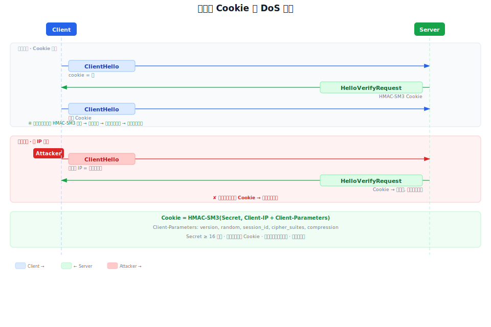

### 10.3 Cookie 生成与验证

**Cookie 生成**：

```
Cookie = HMAC-SM3(Secret, ClientAddr || ClientParams)
```

其中：
- `Secret`：`Config.CookieSecret`，服务端随机产生的密钥，建议 ≥ 16 字节
- `ClientAddr`：服务端所见的客户端 UDP 地址（`IP:Port`，非仅 IP），即 `PacketConn.ReadFrom` 返回的 `net.Addr.String()`
- `ClientParams`：ClientHello 关键字段的序列化字节串，按以下顺序编码：

```
version(2B) || random(32B) || sessionId(1B长度前缀+数据) || cipherSuites(2B长度前缀+每项2B) || compressionMethods(1B长度前缀+数据)
```

> **为什么含端口号？** UDP 环境下，同一 IP 可能有多个客户端实例（不同端口），Cookie 绑定到具体 `IP:Port` 可区分同一主机上的不同连接。

**Cookie 验证**：服务端收到带 Cookie 的 ClientHello 后，用相同方式重新计算 `expected`，与收到的 Cookie 进行**常数时间比较**（防时序侧信道攻击），匹配则继续握手，不匹配则重新发送 HelloVerifyRequest。

服务端不存储 Cookie，通过实时计算和比对验证，全程无状态。

### 10.4 安全保证

| 攻击类型 | 防御效果 |
|----------|----------|
| 源IP伪造放大攻击 | 攻击者必须能接收 Cookie 响应才能继续握手 |
| 半连接资源耗尽 | Cookie 验证通过前服务端不分配任何连接状态 |
| Cookie 重放 | 服务端定期更换 Secret，旧 Cookie 过期失效 |

---

## 11. 密钥生命周期与安全

### 11.1 密钥安全擦除

所有密钥材料在使用后必须安全置零，确保不会残留在内存中：

1. **预主密钥**（`preMasterSecret`）：主密钥生成后调用 `setZero` 置零（反复写 0xFF + 0x00 各 3 遍 + 内存屏障）
2. **主密钥**（`masterSecret`）：工作密钥派生完成后置零
3. **工作密钥**（MAC key、加密 key、IV）：连接 `Close()` 时置零

### 11.2 密钥计算

#### 主密钥

```
master_secret = PRF(pre_master_secret, "master secret",
                    ClientHello.random + ServerHello.random)[0..47]
```

输入：预主密钥（48字节）+ 标签 + 客户端随机数（32字节）+ 服务端随机数（32字节）
输出：主密钥（48字节）

#### 工作密钥

```
key_block = PRF(SecurityParameters.master_secret, "key expansion",
                SecurityParameters.server_random +
                SecurityParameters.client_random)
```

从 key_block 按顺序切分：

```
client_write_MAC_secret[hash_size]
server_write_MAC_secret[hash_size]
client_write_key[key_material_length]
server_write_key[key_material_length]
client_write_IV[fixed_iv_length]
server_write_IV[fixed_iv_length]
```

> **注意**：PRF 的 seed 参数中 `server_random` 在前，`client_random` 在后（与主密钥计算顺序不同）。

### 11.3 SM4 密钥长度

| 算法 | key_material_length | fixed_iv_length | 说明 |
|------|---------------------|-----------------|------|
| SM4-GCM | 16 字节 | 4 字节 | IV 共 12 字节：4 字节固定 IV + 8 字节显式 nonce |
| SM4-CBC | 16 字节 | 16 字节 | 完整 16 字节 IV |

---

## 附录 A：与 DTLS 1.2 的差异对照

| 方面 | DTLS 1.2 (RFC 6347) | DTLCP (GM/T 0128-2023) |
|------|---------------------|------------------------|
| 版本号 | `{254, 253}`（1's complement） | `{0x01, 0x01}` |
| 非对称算法 | RSA/ECDSA | SM2（ECC/ECDHE） |
| 分组密码 | AES（GCM/CBC） | SM4（GCM/CBC） |
| 杂凑算法 | SHA-256 | SM3 |
| PRF | P_SHA256 | P_SM3 |
| 签名算法 | RSA-SHA256, ECDSA-SHA256 | SM2WithSM3 (`0x0704`) |
| 双证书 | 不需要 | 需要（签名证书 + 加密证书） |
| HelloVerifyRequest 版本 | DTLS 1.0 `{254, 255}` | 与协议版本相同 `{0x01, 0x01}` |
| Cookie 最大值 | 255 字节 | 255 字节 |
| 重传定时器最大值 | 60 秒 | 64 秒 |
| 重放窗口默认值 | 64 | 64 |

## 附录 B：参考资料

- GB/T 38636-2020 信息安全技术 传输层密码协议（TLCP）
- GM/T 0128-2023 数据报传输层密码协议规范（DTLCP）
- RFC 6347 Datagram Transport Layer Security Version 1.2
- RFC 5246 The Transport Layer Security (TLS) Protocol Version 1.2
- GB/T 32918 信息安全技术 SM2 椭圆曲线公钥密码算法
- GB/T 32905 信息安全技术 SM3 密码杂凑算法
- GB/T 32907 信息安全技术 SM4 分组密码算法
- GB/T 20518 信息安全技术 公钥基础设施 数字证书格式规范
