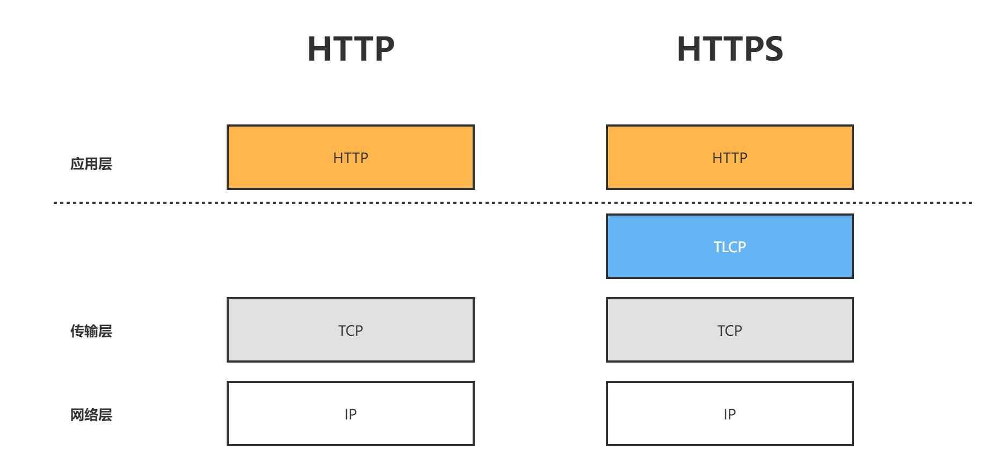

# GoTLCP HTTPS 配置

## 1. HTTPS原理概述

TLCP协议作为传输层密码协议，在握手完成后认为建立TLCP连接，对于上层应用来说TLCP是透明的，上层应用依然可以使用Socket接口进行通信，
只不过通信实现为TLCP协议保护的安全通信，不是TCP协议。

基于上述原理可以将HTTP下方的协议替换为TLCP协议，就这就是HTTPS，协议栈结构如下所示：




## 2. 服务端

> 若您需要配置双向身份认证请参考 [《GoTLCP 服务端配置》](./ServerConfig.md)

### 2.1 Go标准库 HTTPS

标准库实现TLCP HTTPS流程如下：

1. 创建 `http.Server` 对象，设置HTTP路由等。
2. 通过 `tlcp.Listen` 方法，配置并启动TLCP Listener。
3. `http.Server` 对象的`Serve` 方法传入TLCP Listener对象。

```go
package main

import (
	"gitee.com/Trisia/gotlcp/tlcp"
	"net/http"
)

func main() {
	// 省略部分初始化代码...
	
	config := &tlcp.Config{Certificates: certKeys}

	serveMux := http.NewServeMux()
	// 设置HTTP路由
	serveMux.HandleFunc("/", func(w http.ResponseWriter, r *http.Request) {
		_, _ = w.Write([]byte("Hello GoTLCP!"))
	})
	// 1. 构造 HTTP服务
	svr := http.Server{Addr: ":443", Handler: serveMux}
	// 2. 创建 TLCP Listen
	ln, err := tlcp.Listen("tcp", svr.Addr, config)
	if err != nil {
		panic(err)
	}
	// 3. 通过 TLCP Listen 启动HTTPS服务
	err = svr.Serve(ln)
	if err != nil {
		panic(err)
	}
}
```

完整示例见 [server/raw/main.go](../example/https/server/std/main.go)

## 2.2 Gin 配置

> [Gin Web Framework](https://github.com/gin-gonic/gin)

与标准Go的HTTPS配置类似的，Gin的HTTPS配置方式如下：

1. 创建 `gin.Engine` 对象，作为HTTP服务的处理函数。
2. 创建 `http.Server` 对象，设置HTTP路由等。
3. 通过 `tlcp.Listen` 方法，配置并启动TLCP Listener。
4. `http.Server` 对象的`Serve` 方法传入TLCP Listener对象。


```go
package main

import (
	"gitee.com/Trisia/gotlcp/tlcp"
	"github.com/gin-gonic/gin"
	"net/http"
)

func main() {
	config := &tlcp.Config{Certificates: load()}

	// 1. 创建 gin 的HTTP处理器
	router := gin.Default()
	router.GET("/", func(ctx *gin.Context) { ctx.String(200, "Hello GoTLCP Gin!") })

	// 2. 通过Gin的处理器构造 HTTP服务
	svr := http.Server{Addr: ":443", Handler: router}
	// 3. 创建 TLCP Listen
	ln, err := tlcp.Listen("tcp", svr.Addr, config)
	if err != nil {
		panic(err)
	}
	// 4. 通过 TLCP Listen 启动HTTPS服务
	err = svr.Serve(ln)
	if err != nil {
		panic(err)
	}
}
```

完整示例见 [server/raw/main.go](../example/https/server/gin_demo/main.go)

## 3. 客户端

GoTLCP提供了简单的方法来构造HTTPS客户端，构造的HTTP客户端您可以和普通的HTTP客户端一样使用没有差别。

配置如下：

1. 初始化TLCP配置。
2. 创建TLCP HTTPS客户端。
3. 使用 HTTP客户端通信。

```go
package main

import (
	"gitee.com/Trisia/gotlcp/https"
	"gitee.com/Trisia/gotlcp/tlcp"
	"io"
	"os"
)

func main() {
	// 1. 初始化TLCP配置
	config := &tlcp.Config{RootCAs: load()}

	// 2. 创建TLCP HTTPS客户端
	client := https.NewHTTPSClient(config)
	
	// 3. 使用 HTTP客户端通信
	resp, err := client.Get("https://127.0.0.1")
	if err != nil {
		panic(err)
	}
	_, err = io.Copy(os.Stdout, resp.Body)
	if err != nil && err != io.EOF {
		panic(err)
	}
}

```

若您需要客户端连接超时时间进行配置，请使用：

- `https.NewHTTPSClientDialer(dialer *net.Dialer, config *tlcp.Config) *http.Client`


> 若您需要配置双向身份认证请参考 [《GoTLCP 客户端配置》](./ClientConfig.md)

完整示例见 [server/raw/main.go](../example/https/client/main.go)

