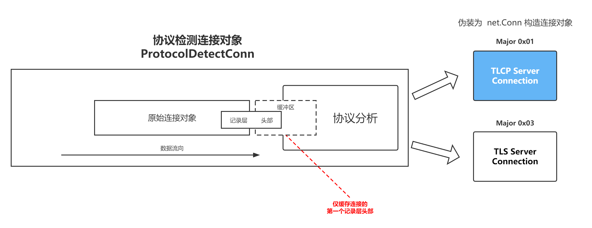

# GoTLCP 协议适配器 

**P**rotocol **A**dapter 协议适配器

协议适配器用于适配标准TLS与TLCP协议的自动切换，在适配选择完成后支持双协议同时工作。

## 1. 快速入门

若需要使用GoTLCP PA您需要同时提供TLCP的连接配置对象`tlcp.Config`以及TLS的连接配置对象`tls.Config`除此之外无需任何额外配置，
若您需要双向身份认证以及其它特性只需按照标准的`tls.Config`或`tlcp.Config`配置对应对象即可。

实例代码如下：

```go
package main

import (
	"crypto/tls"
	"gitee.com/Trisia/gotlcp/pa"
	"gitee.com/Trisia/gotlcp/tlcp"
)

func main() {
	var err error
	tlcpCfg := &tlcp.Config{
		Certificates: []tlcp.Certificate{sigCert, encCert},
	}
	tlsCfg := &tls.Config{
		Certificates: []tls.Certificate{rsaCert},
	}

	listen, err := pa.Listen("tcp", ":9443", tlcpCfg, tlsCfg)
	if err != nil {
		panic(err)
	}
	defer listen.Close()
	for {
		conn, err := listen.Accept()
		if err != nil {
			panic(err)
		}
		// do something
	}
}
```

示例见 [server/pa/main.go](../example/server/pa/main.go)


## 2. 实现原理

GoTLCP PA利用TLS/TLCP协议具有相同的记录层头的特征，在连接建立后首先对连接进行检测。

1. 接受连接，构造一个特殊协议类型检测连接对象，该对象会读取来自于客户端的个记录层消息的头部。
2. 通过记录层头部的协议版本号来区分TLCP、TLS协议，并记录协议主版本号（major version）。
3. 通过缓存读取的方式将自己伪装成一个原始的 `net.Conn` 接口，然后根据协议的主版本号进入对应的协议栈实现TLS/TLCP。

实现原理如下：



见代码：

- [pa.go](./pa.go)
- [conn.go](./conn.go)